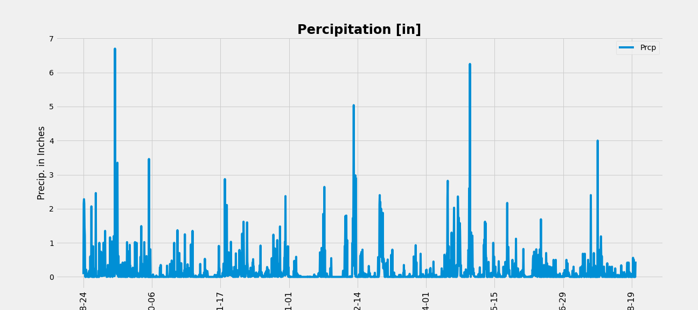

# Module 10 Challenge
## Advanced Data Storage and Retrieval

# Background
Congratulations! You've decided to treat yourself to a long holiday vacation in Honolulu, Hawaii. To help with your trip planning, you decide to do a climate analysis about the area. The following sections outline the steps that you need to take to accomplish this task.

# Part 1: Analyze and Explore the Climate Data

## Precipitation Analysis
Find the most recent date in the dataset (2017-08-23) and use it to query the previous 12 months of data. Plot the results.


```python
# Use Pandas to calculate the summary stats for the precipitation data
Prcp
count	2015.000000
mean	0.176462
std	0.460288
min	0.000000
25%	0.000000
50%	0.020000
75%	0.130000
max	6.700000
```

## Station Analysis

Design a query to calculate the total number stations in the dataset

```python
PrecipData['Station'].nunique()

7
```

Design a query to find the most active stations. List the stations and the counts in descending order.
```python
activity = PrecipData.groupby(['Station']).size().sort_values(ascending=False)
most_active = activity.index[0]
print(activity)
print(f"The station with the most activity is Station {most_active}")
```

```python
Station
USC00519397    358
USC00519281    351
USC00513117    342
USC00516128    327
USC00519523    313
USC00514830    264
USC00517948     60
dtype: int64
The station with the most activity is Station USC00519397
```

Design a query that calculates the lowest, highest, and average temperatures that filters on the most-active station id found in the previous query.

```python
StationMin = session.query(func.min(Measurement.tobs)).\
    filter (Measurement.station== (most_active)).all()
StationMax = session.query(func.max(Measurement.tobs)).\
    filter (Measurement.station== (most_active)).all()
StationAvg =session.query(func.avg(Measurement.tobs)).\
    filter (Measurement.station== (most_active)).all()

print(f"At station {most_active}, the lowest temperature was {StationMin}, the highest temperature was {StationMax}, and the average temperature is {StationAvg}")
```

```python
At station USC00519397, the lowest temperature was [(56.0,)], the highest temperature was [(87.0,)], and the average temperature is [(74.55323054331865,)]
```

Design a query to get the previous 12 months of temperature observation (TOBS) data and plot the results in a histogram.


# Part 2: design Your Climate App

